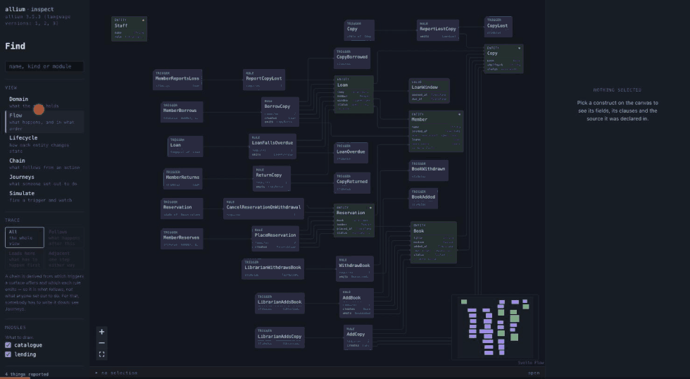

# allium-inspect

Read an [Allium](https://github.com/juxt/allium) specification in a browser, and
run its rules.

```sh
allium-inspect specs/
```



Reads a spec set, binds a free port, and opens a browser onto five views of it
plus a simulator. It keeps up: the browser asks once a second whether the answer
has changed, so an edit lands without a reload, and a spec that stops parsing
says so across the top rather than leaving you reading a picture of a file that
no longer says that. Nothing is uploaded and nothing is persisted; it is one
binary and the specs you point it at.

There is a second command in the box. `allium-journey` walks
[journeys](#journeys) — executable claims about what an actor can do — against
the same spec set, from a Makefile rather than a browser:

```sh
allium-journey walk specs/ journeys/
```

## Install

There are no binary releases yet — build it from source. You will need
[Rust 1.96](https://rustup.rs) (the pinned toolchain installs itself),
[Node 20+](https://nodejs.org) for the browser interface, and
[`just`](https://github.com/casey/just):

```sh
git clone https://github.com/mpecan/allium-inspect
cd allium-inspect
just ui-install && just build-release
```

That leaves two binaries in `target/release/` — `allium-inspect` and
`allium-journey`. Copy them onto your `PATH`, or run them from there.

Build the interface before the binaries, which is what `just build-release`
does: the browser bundle is baked into the executable at compile time, so a bare
`cargo build` produces a binary that serves a page telling you to run
`just build`.

You also need the **`allium` CLI** on `PATH`:

```sh
brew install juxt/allium/allium
```

Two of the four documents this reads come from that binary. The other two —
`parse` and `analyse` — are calls into `allium-parser`, allium's own library
crate, pinned to the version the recorded fixtures were made from. So this never
reimplements allium's parser, and an upstream change to the AST is a compile
error here rather than a fixture that silently misparses. `model` and `plan`
still need the process, because allium builds those in a crate with no library
target.

## Why

The `allium` CLI emits well-structured JSON, and every command answers about one
file. Real spec sets are modular and cross-referential — `friend-mesh` is five
files and 6,700 lines with references like `membership/Group` crossing between
them — and no existing tool draws that shape. The official VS Code extension has
a diagram preview and a rule simulator; both are thin, and both stop at one file.

Two things follow from reading the set as a set:

- **Cross-module references become edges.** Over a five-module set like
  `friend-mesh`, that is several hundred constructs and around a tenth of the
  edges crossing a module boundary. `allium model` reports the target of one of
  those relationships as the literal string `unknown`, because from inside one
  file it *is*.
- **The simulator can follow a chain out of the module it started in.** A rule
  emitting `MessageSent` in `messaging` is consumed by `QueueOnSend` in
  `delivery`, and walking that is the closest an Allium spec gets to describing a
  user journey — the language has no journey construct.

## The views

| View | Answers |
|---|---|
| **Domain** | what the spec holds — entities, fields, relationships, enums |
| **Flow** | what happens and in what order — trigger → rule → entity → trigger |
| **Lifecycle** | how each entity changes state — one state machine per entity |
| **Chain** | what *follows* from an action, traced forward or backward |
| **Journeys** | what somebody *set out to do*, walked against the spec |

And one mode that is not a view:

| Mode | Does |
|---|---|
| **Simulate** | fire a trigger against a world and watch what the spec does |

Chain and Journeys answer next to each other on purpose. A chain is derived —
which triggers a surface offers, which each rule emits — so it is what follows.
A journey is written by a person. The language has no construct for one, so
somebody has to say it — and because somebody wrote it, a journey gets the same
source strip a spec does: selecting a step moves it to the line that step is
written on, so the verdict and the sentence that earned it stay together.

`/` opens search, which matches a construct's name, its kind or the module it
is in — and opening a result clears whatever was in the way, turning its module
back on and switching to a view that draws it.

Tracing dims what the chain did not reach, which answers "which of these three
hundred?" by leaving all three hundred on the canvas. **Double-clicking a
construct** opens it on its own instead: the construct, everything joined to it,
and three ways of asking — adjacent, what follows, what leads to it — each laid
out and framed on its own. Double-clicking inside walks to the next construct,
so a chain can be followed a step at a time. The canvas behind it never moves.

The pop-up asks about the construct rather than about the current view, so it
shows the rule that creates an entity and the invariants that constrain it even
from the domain view, which draws neither. An entity that declares transitions
also offers its **lifecycle** there — the whole-canvas lifecycle view draws
eighty state machines at once, and this is the one you are holding. A form with
no answer is switched off and says why rather than opening empty.

The viewport follows what you are looking at. Switching views frames the new
one; applying a trace frames what it reached, so a chain that spans the graph is
on screen in full rather than partly off the edge of a picture scaled for
something else.

Edges follow the route the layout engine chose for them rather than a curve
between two handles: ELK reserves channels between the layers as it places the
nodes, and drawing along those is the difference between a diagram and a bowl of
spaghetti on any view with more than a dozen constructs.

**The prose comes with it.** More than half of a real spec set is comment: most
of `friend-mesh`'s entities open with a paragraph saying why they exist, many of
its fields carry one, and a hundred-odd rules have a `@guidance` block. That
writing is where the reasoning lives, and the panel used
to show the fields and leave the paragraph explaining them four lines up in a
file nobody had open. A construct's note sits above its detail, a field's note
under the field, and `@guidance` under a heading that says nothing checks it.

The parser drops comments, so a note is sliced out of the source by walking back
from the declaration's own byte span. It has to be contiguous — a blank line
ends the block — which is what stops one construct inheriting another's
paragraph, or a file's `-- Rules` banner.

Selecting anything shows its source, anchored to the byte span the parser
reported. The spec text gets permanent space along the bottom rather than a
tooltip: in a spec explorer the text is the artifact and the graph is one way of
looking at it.

## The simulator

Build a world, fire a trigger, and the simulator evaluates the rule's
preconditions against it, applies its postconditions, checks every invariant, and
reports which state-condition rules the change just made possible.

**It never guesses.** An Allium expression can be true, false, or something a
simulator has no way to decide — a derived value the spec computes and this does
not, a name nobody bound, a comparison between kinds that do not compare.
Choosing a default for that third case is the failure worth avoiding: treat it as
true and rules fire that should not have, treat it as false and rules are
reported blocked by a precondition nothing checked. Either way the simulator
states a conclusion it did not reach.

So `unknown` is a real verdict, it propagates by Kleene's rules, and it carries
the sub-expression and source span that could not be settled. It is also the only
verdict on the panel that gets a fill, because it is the only one that needs a
person.

A state change is checked against the entity's declared lifecycle. `transitions
status { visible -> tombstoned }` is a claim about what may happen, so an
assignment the graph does not permit is refused and reported rather than written.

The clock is a field you advance rather than a reading of the system clock, so a
rule waiting on a due date is something you step *to*, and a run reproduces
exactly.

## Options

```
allium-inspect [PATHS]...

  --port <PORT>          bind this port instead of a free one
  --no-open              do not open a browser
  --no-watch             do not reload when a spec changes
  --journeys <PATH>      journeys to walk, shown in the Journeys view
  --check                print the journey report and exit, without serving
  --strict               implies --check: fail on what the spec cannot support
  --json                 implies --check: print the report as JSON
  --print-graph          print the whole graph as JSON and exit
  --allium <PATH>        the allium binary to run
```

`--print-graph` makes the whole pipeline scriptable:

```sh
allium-inspect --print-graph specs/ | jq '[.edges[] | select((.from|split("::")[0]) != (.to|split("::")[0]))]'
```

## Building

```sh
just build     # the frontend, then the workspace
just run specs/
just check     # every fast gate
```

`just --list` for the rest.

## How it is put together

```
crates/inspect-model     four documents per file → one linked SpecGraph   [pure]
crates/inspect-sim       three-valued evaluator, world, step engine       [pure]
crates/inspect-journey   journeys: a grammar, a static check, a walk      [pure]
crates/inspect-server    axum routes; the built UI embedded in the binary
apps/inspect             the browser: a free port, a browser, a watcher
apps/journey             allium-journey: the same engine, as a command
ui                       Svelte 5, with wire types generated from the Rust
```

The three pure crates hold all the logic and touch no clock, socket or random
number generator. `inspect-sim` walks `allium_parser::ast::Expr` directly and
touches no JSON at all, so an expression form the language gains stops the build
here rather than reporting itself as `unknown` at run time.

The two commands that still need the process are reached through a trait, so
ingestion and simulation are tested against recorded real output with no binary
installed.

Four documents are read per spec file, not one: `model` describes entities but
carries no spans, `parse` is the only source of rules, surfaces and positions,
`plan` supplies the trigger → rule → entity chain, and `analyse` the findings.
Linking then runs once over the whole set.

The expression trees never cross the wire. They are an order of magnitude larger
than the graph and only the simulator reads them, so what travels is a world in
and a step out — which is also what makes the server stateless and a whole run a
value the browser can step back through.

## Who this is for

Five people who would open it are written down in
[`docs/personas/`](docs/personas/) — a spec author, a domain lead who does not
write Allium, an implementer, a reviewer, and someone who joined on Monday. They
exist so that a review of the interface has something to be a review *of*:
"the rail is cluttered" and "the rail is thorough" are the same observation from
two people with different jobs, and only naming the job settles it.

Reviews run against them live in [`docs/reviews/`](docs/reviews/).

## Journeys

A **journey** is an executable claim about what an actor can do, written beside
the spec rather than in it — and written *first*, so a step naming a surface the
spec does not have is a requirement nobody has met rather than an error.

```
journey ACopyGoesOutAndComesBack {
    goal: Ada borrows a copy, keeps it a fortnight, and brings it back
          before it falls due.

    cast:
        ada:  Member
        copy: catalogue/Copy

    given:
        ada.is_at_limit = false
        copy.status = available

    1. she borrows it
        ada does MemberBorrows(ada, copy) on MemberShelf
            creating loan: Loan
        then loan.status = open
        then copy.status = on_loan

    2. a fortnight passes
        after 14.days

    3. she brings it back
        ada does MemberReturns(loan) on MemberShelf
        then copy.status = available

    ends: The copy is back on the shelf and Ada owes nothing.
}
```

Every name in it is one the spec declares — the checker rejects any that is not.
What a journey adds is the part the spec has no way to say: *these particular
people, in this order, and this is what should be true afterwards.* The cast is
instances rather than roles, because two members with different preconditions is
the ordinary case.

### Two ways to run one

In the browser, as a view:

```sh
allium-inspect --journeys journeys/ specs/
```

Or as a command that sits beside `allium` in a Makefile:

```sh
allium-journey walk specs/ journeys/     # run them
allium-journey check specs/ journeys/    # the static half, without a world
```

Each `PATH` is a spec, a journey, or a directory holding either — searched
recursively, told apart by extension. It prints one JSON document per journey
file, in the envelope `allium analyse` uses, so anything that already reads
allium reads this:

```sh
allium-journey walk specs/ journeys/ | jq -r '.findings[].summary'
allium-journey walk specs/ journeys/ --text     # for a person instead
```

Exit codes follow allium's: `0` nothing to say, `1` something reported, `2`
nothing to read. `--report` exits 0 anyway, which is the mode a journey is
*written* in.

### What a step can come back as

```
AReaderRenewsALoan  —  0 of 1 steps hold
   1. she asks for another three weeks                 unspecified
        ada does MemberRenews(ada) on MemberShelf
          no surface offers `MemberRenews`
        then RenewLoan fires
          no rule called `RenewLoan`
```

Six verdicts. Three are the simulator's own — **holds**, **refused**,
**undecided** — and two are what a journey needs and a simulation does not:
**unspecified**, which is the backlog, and **unexposed**, which is a system that
does the right thing and tells nobody. The sixth is a **remark**.

Telling them apart is the whole point. "The spec forbids this", "the spec has
never heard of this" and "this tool could not tell" are three different pieces
of work, and a reader who sees one failure for all three will go and change a
specification that is not wrong.

### And what actually happened

A verdict says whether the *specification* supports a step. Whether the
**software** does it is a different claim, and evidence is where that one is
answered: a test run photographs the product, each picture says which step it
shows, and the panel puts them under the steps they are of.

```sh
just walk                                             # drive the UI, seal what it took
allium-inspect --journeys journeys/ --evidence target/evidence/ --code . specs/
```

```text
2 claimed  3 shown       theme [ dark ▾ ]
```

Five standings, and the useful ones are the negative ones. **claimed** is a test
that says it demonstrates a step and produced nothing — without a marker in the
code that is indistinguishable from a step nobody ever covered. **stale** is a
picture taken before the step was reworded, shown beside what the step used to
say. A journey can declare the ways it should be shown, and then the control
appears before any picture does.

### Reading further

| | |
|---|---|
| [`reference.md`](docs/journeys/reference.md) | every form a journey can contain, one runnable example each |
| [`evidence.md`](docs/journeys/evidence.md) | the marker, the log, the seal, the tags |
| [`adopting.md`](docs/journeys/adopting.md) | adding journeys to a repository that has none |
| [`README.md`](docs/journeys/README.md) | the design, and what is deliberately left out |

## Quality gates

`just check` runs the fast ones in about a minute. Every gate is driven in both
directions by `just gates-selftest`, which runs inside `check`: a gate that
cannot fail is worse than no gate.

Coverage has a floor that ratchets upward toward 95% and never down, enforced in
the hot path by a receipt-freshness check rather than by measuring on every
commit.

Mutation testing is a decision rather than a step — it costs minutes and a gate
people skip is a gate that cannot fail. What runs automatically is
`just mutation-debt`, which measures how much Rust has changed since the last
recorded run and escalates: silent under 250 lines, a warning to 500, and a block
past that or past 20 Rust-touching commits. So the cadence follows code volume,
and the deferral is bounded.

## Contributing

Bug reports and patches are welcome. [`CONTRIBUTING.md`](CONTRIBUTING.md) covers
getting set up, what `just check` does, and the three gates here that are shaped
unusually enough to be worth reading about before you fight them.

The shortest useful bug report is the spec that provoked it.

## Licence

MIT — see [`LICENSE`](LICENSE). The same licence allium itself uses, which is
what makes a contribution upstream frictionless if any of this ever belongs
there.

The project's own code is MIT throughout. A binary built here is not MIT alone,
because it carries its dependencies with it:

- `allium-parser`, MIT, from the Allium project. Its own LICENSE names no
  copyright holder, so [`NOTICE`](NOTICE) reproduces the notice as written.
- the built browser interface, which is npm code. Most of it is MIT or ISC;
  **elkjs**, which does the graph layout, is `EPL-2.0 OR GPL-3.0-or-later` and
  is taken here under the **EPL-2.0** arm.

`ui/public/THIRD-PARTY.txt` lists all 39 of them with their full licence text,
and the running tool serves it at `/THIRD-PARTY.txt`. Ship it and
[`NOTICE`](NOTICE) alongside any binary you distribute.

Two gates keep that honest: `just deny` audits the Rust tree, and
`just third-party-check` fails if the notice no longer matches what the bundle
ships, or if a frontend dependency arrives under a licence nobody reviewed.
